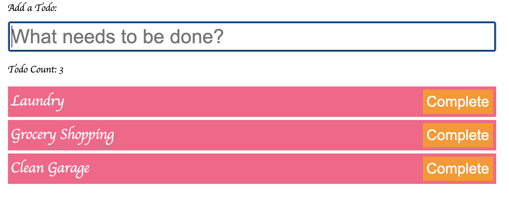

# To Do List (Local Server)

## Description

[Deployment](https://anusontarangkul.github.io/to-do-list-local-server/)
This app is a todo list that helps you keep organize with all of the tasks you have to do.

## Technologies

- Javascript
- HTML
- CSS

## Installation

No instalation needed

## Usage

You type your todo into the form and press enter. Once you finish the todo, you press complete to clear it.
Here is the video tutorial on Youtube.
[Youtube](https://www.youtube.com/watch?v=7EajOseIdUs&feature=youtu.be)

## Credits

David Anusontarangkul
[LinkedIn](https://www.linkedin.com/feed/)

[Github](https://github.com/anusontarangkul)

Project was part of UC Berkeley in class activity on learning Javascript.

## License

Copyright <2020> <David Anusontarangkul>

Permission is hereby granted, free of charge, to any person obtaining a copy of this software and associated documentation files (the "Software"), to deal in the Software without restriction, including without limitation the rights to use, copy, modify, merge, publish, distribute, sublicense, and/or sell copies of the Software, and to permit persons to whom the Software is furnished to do so, subject to the following conditions:

The above copyright notice and this permission notice shall be included in all copies or substantial portions of the Software.

THE SOFTWARE IS PROVIDED "AS IS", WITHOUT WARRANTY OF ANY KIND, EXPRESS OR IMPLIED, INCLUDING BUT NOT LIMITED TO THE WARRANTIES OF MERCHANTABILITY, FITNESS FOR A PARTICULAR PURPOSE AND NONINFRINGEMENT. IN NO EVENT SHALL THE AUTHORS OR COPYRIGHT HOLDERS BE LIABLE FOR ANY CLAIM, DAMAGES OR OTHER LIABILITY, WHETHER IN AN ACTION OF CONTRACT, TORT OR OTHERWISE, ARISING FROM, OUT OF OR IN CONNECTION WITH THE SOFTWARE OR THE USE OR OTHER DEALINGS IN THE SOFTWARE.
